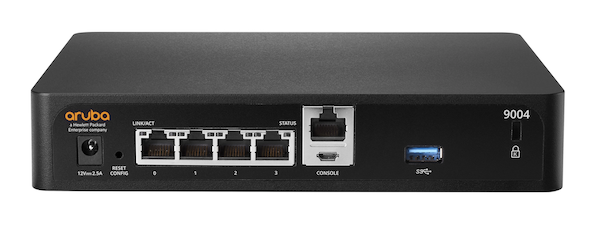

# Using SNMP & regex & Python to identify network devices

---

# What is SNMP

- A lightweight, UDP-based protocol for monitoring & managing networked devices.
- **OID** (Object Identifier): dotted path to a metric (e.g., `1.3.6.1.2.1.1.1.0` = `sysDescr.0`)

---

# Example: Aruba 9004




```
ArubaOS (MODEL: Aruba9004), Version 8.7.0.0-2.3.0.4 (82267)
```

---

# Basic regex

* **Literals & classes:** normal chars match themselves; `.` any char; `[abc]` set; `[^abc]` negated; shorthands `\d \w \s` (and `\D \W \S`).
* **Quantifiers (greedy by default):** `*` 0+, `+` 1+, `?` 0/1, `{m,n}`; add `?` to make them lazy (e.g., `+?`).
* **Anchors & boundaries:** `^` start, `$` end, `\b` word boundary, `\B` non-boundary.
* **Grouping & captures:** `( … )` capture, `(?: … )` non-capturing.
* **Alternation & scope:** `A|B` either; use groups to limit scope: `gr(e|a)y`.

---

# Recog repository

- Recog is an open-source framework
- Identifies network products, services etc.
- [Here](https://github.com/rapid7/recog/blob/29c64f954d300a6b188066b505fd6b41289dca36/xml/snmp_sysdescr.xml#L790) is regex for Aruba Switch.

---

# Python code

- `parsing.py` - simple parsing using Python `re` module
- `send_snmp_request.py` - sends an SNMP request to a removed device and prints output

```
pip install pysnmp
```

- You can also use `snmpget` command

```
snmpget -v2c -c public HOST 1.3.6.1.2.1.1.1.0
```

---

# Links

- [recog repository](https://github.com/rapid7/recog)
- [Shodan](https://www.shodan.io/)
- [Installing and Configuring SNMP on Fedora 38](https://reintech.io/blog/installing-configuring-snmp-fedora-38)
